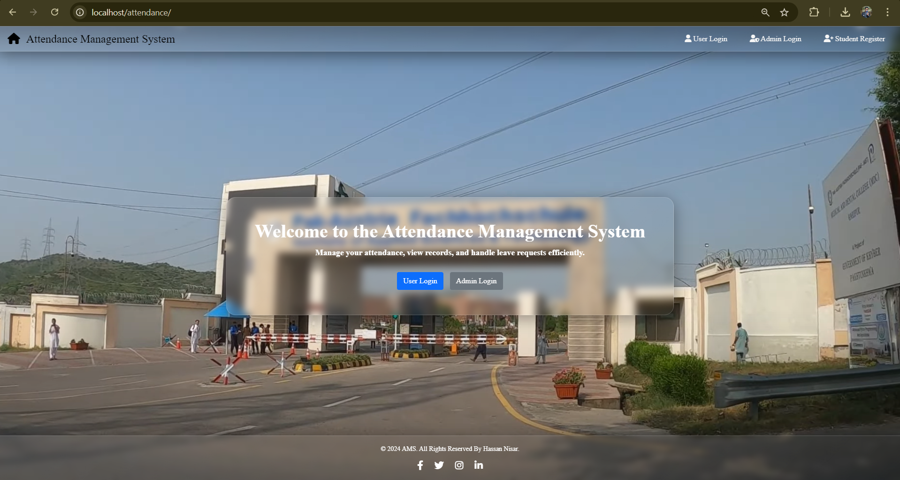
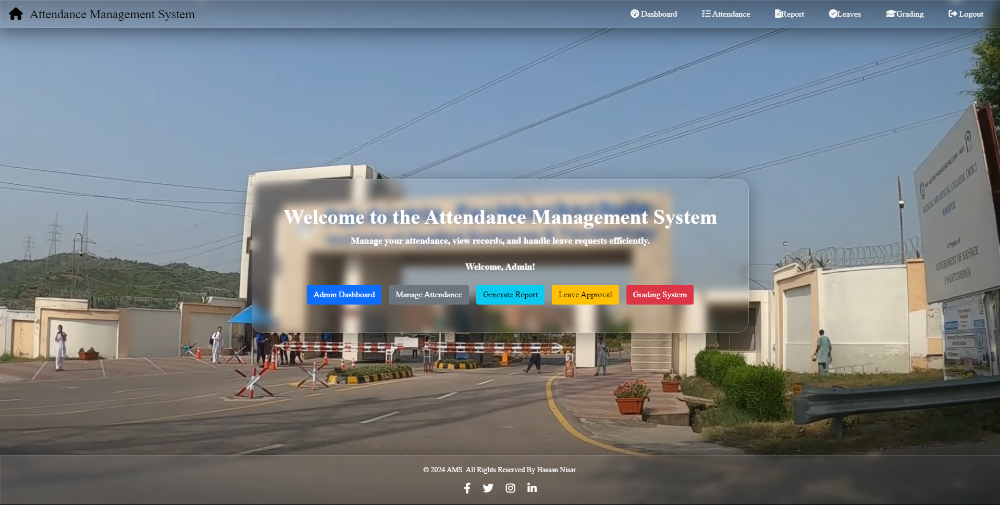
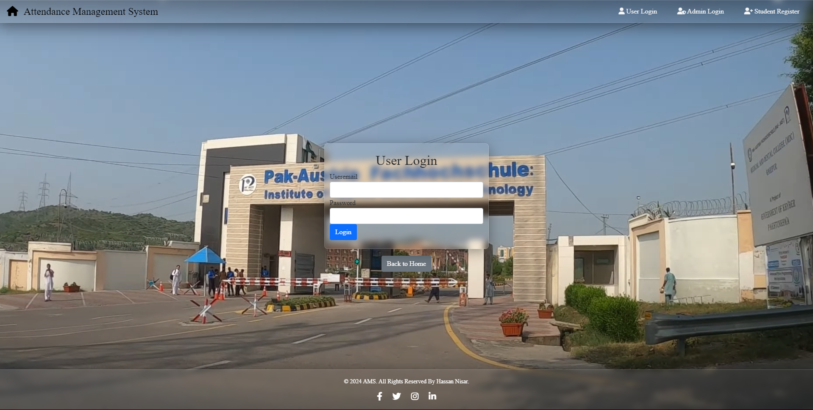
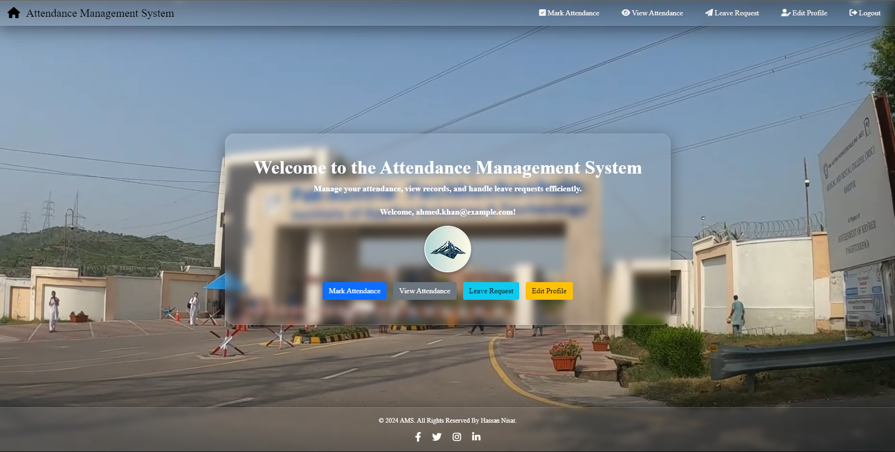

# AMS
# Hi, I'm Hassan Nisar! 👋  
                
## 🚀 About Me  
I am a passionate and driven Artificial Intelligence undergraduate currently in my fourth semester. My journey in technology has been fueled by a strong desire to innovate and create impactful solutions. With hands-on experience in web development, I have honed my skills in HTML, CSS, JavaScript, PHP, and ASP.NET, and developed projects.

I am eager to apply my knowledge in AI and web development in real-world scenarios, and I am actively seeking internship opportunities where I can contribute and grow. With a strong work ethic and a commitment to excellence, I am excited about the possibilities that lie ahead. 
    
## 🔗 Links  
[](https://www.linkedin.com/in/hassan-nisar0005/)  
[](https://www.linkedin.com/in/hassan-nisar0005/)  
[](https://github.com/HassanNisar0005/)  
    
## 🛠 Skills  
Web-dev(Backend), PHP, Laravel, Jquery, JavaScript, Bootstrap ...  
# Attendance Management System

This project is a simple Attendance Management System developed using PHP, MySQL, HTML, CSS, Bootstrap, and JavaScript. It allows users to log in, register, mark attendance, submit leave requests, and view attendance records. The system is designed for both students and administrators, with different functionalities available to each user type.
## Screenshots  
## Index Page
  
## Admin Dashboard
  
## Admin/User Login
  
## User Dashboard.
  

## Table of Contents

- [Features](#features)
- [Technologies Used](#technologies-used)
- [Installation](#installation)
- [Usage](#usage)
- [Database Structure](#database-structure)
- [Contributing](#contributing)
- [License](#license)

## Features

- **User Registration & Login**: Users can register and log in to access their dashboard.
- **Attendance Marking**: Users can mark their attendance.
- **Leave Request**: Users can submit leave requests with a reason.
- **View Attendance**: Users can view their attendance records.
- **Profile Picture Upload**: Users can upload and change their profile pictures.

## Technologies Used

- **Frontend**:
  - HTML
  - CSS (Bootstrap 5)
  - JavaScript (jQuery)
  
- **Backend**:
  - PHP
  - MySQL

- **Server**:
  - XAMPP (Apache, MySQL, PHP)

## Installation

1. **Clone the Repository**:
   ```bash
   git clone https://github.com/HassanNisar0005/AMS

## Usage
 - Register: Register a new account by providing your name, email, and password.
 - Login: Log in with your registered email and password.
 - Mark Attendance: On the dashboard, click on "Mark Attendance" to log your attendance for the day.
 - Submit Leave Request: Use the "Mark Leave" button to submit a leave request. Provide a reason for the leave.
 - View Attendance: Use the "View Attendance" button to view your attendance records.

## Database Structure

    User:
    UserID (INT, Primary Key)
    Username (VARCHAR)
    Email (VARCHAR)
    Password (VARCHAR)
    ProfilePicture (VARCHAR)

    AttendanceRecords:
    RecordID (INT, Primary Key)
    UserID (INT, Foreign Key)
    Date (DATE)
    Time (TIME)
    Status (ENUM: 'Present', 'Absent')
    
    LeaveRequests:
    LeaveID (INT, Primary Key)
    UserID (INT, Foreign Key)
    LeaveReason (TEXT)
    LeaveDate (DATE)
    Status (ENUM: 'Pending', 'Approved', 'Rejected')
    CreatedAt (TIMESTAMP)

## License
### Notes:
- Replace the GitHub repository URL with your own.
- Ensure the database and directory paths match your setup.
- Add any additional details specific to your project as needed.
    
## Other Common Github Profile Sections  
👩‍💻 I'm currently studing in Paf-Iast Haripur,Pakistan.
    
🧠 I'm currently learning Python    
    
💬 Ask me about...  
   - How to set up the project locally.
   - Customizing the user interface.
   - Extending the functionality of the Attendance Management System.
   - Troubleshooting common issues.
   - Contributing to this project.
   - Anything related to web development or this project!.
    
📫 How to reach me.... hassannisar0005@gmail.com  
    
⚡️ Fun fact...  
    This project was inspired by my own need to manage attendance more efficiently during my college years! It started as a small experiment and quickly grew into a fully functional system. Also, the profile pictures are randomly set if none are uploaded—so you might just find a quirky image if you skip that step!
